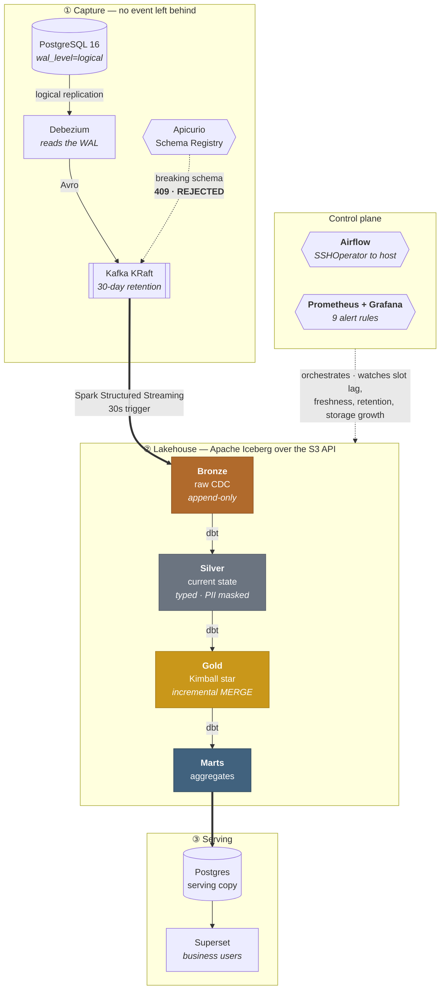
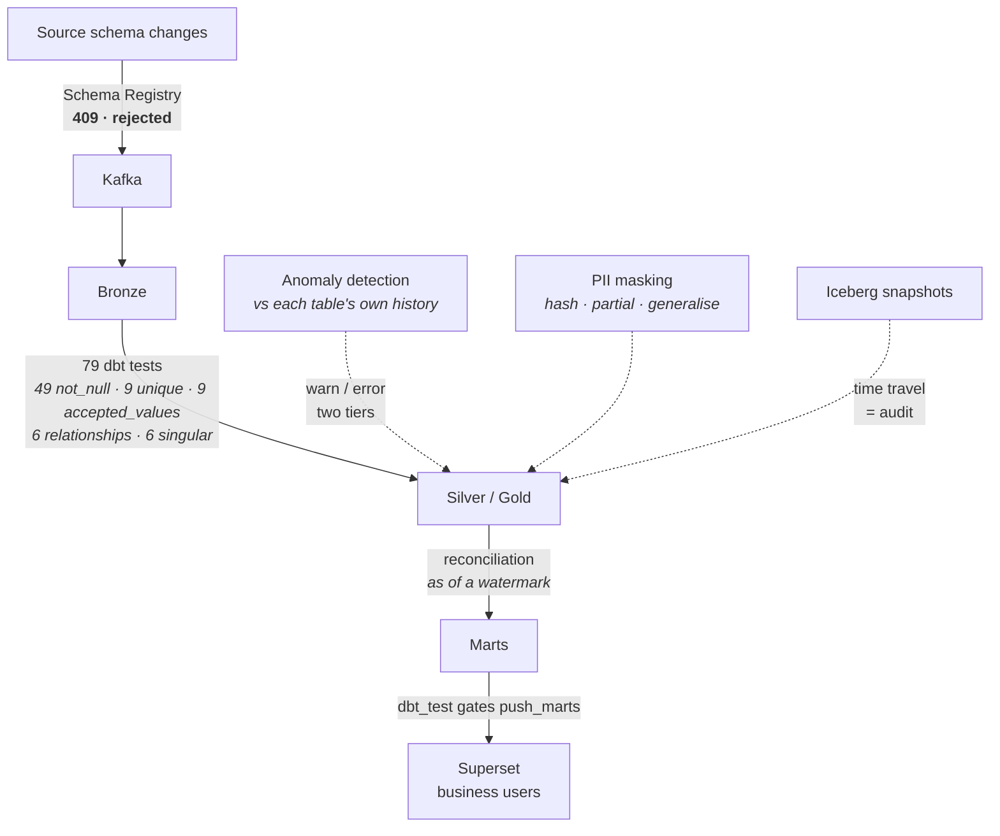

# Governed Transaction Lakehouse

[](https://github.com/Senryuu-0211/Governed-Transaction-Lakehouse/actions/workflows/ci.yml)


A near-real-time banking transaction pipeline and **governed lakehouse**, built
correctness-first and governance-first. It captures every transaction change via
**Change Data Capture (CDC)** with no lost events, lands it in an **ACID lakehouse**
with audit and time-travel, and enforces data quality, lineage, and PII controls.

> **Designed for bank-scale, demoed at small scale — and the boundary is stated explicitly.**
> The architecture is built to scale to billions of transactions; the demo runs at a modest
> rate on a single host. Where a choice is "designed to scale to X" vs "demo runs at Y", the
> code says so.

**What this repo is really about:** not that these tools were wired together, but *why each
one is there and what breaks without it*. Every threshold, retention window, and guard rail
below traces to a specific failure — several of which happened here, on this hardware, and are
written up in [`issues/`](issues/) rather than quietly fixed. Two of those write-ups end with
the admission that my own earlier diagnosis was wrong; they are kept that way on purpose.

---

## Evidence, not claims

Every number below is produced by a script in this repo, on the run of **06 Aug 2026**.

| | |
|---|---|
| Bronze rows | **7.88 M** — `transactions` 5,521,930 · `accounts` 2,357,567 · `merchants` 200 |
| CDC operations captured | `c` 2,718,757 · `u` 2,770,405 · **`d` 16,311** · `r` 146 · **tombstones 16,311** |
| Silver / Gold current state | 2,708,954 rows after deduplication |
| Reconciliation, Bronze ↔ Gold | 2,692,703 txns · **$11,207,350,475.15** · difference **$0.00** |
| dbt | 12 models · 79 data tests · **91 PASS / 0 ERROR / 0 WARN in 85 s** |
| CI | 4 jobs green on every push |
| Storage backend swap | proven **both directions** without touching a line of model code |

The delete count matters more than the volume: `d` events and tombstones match exactly
(16,311 each), which is the evidence that deletes are captured — the thing timestamp-polling
ingestion silently loses.

---

## Architecture

Compute runs on-premise. Storage is **object storage reached only through the S3 API** —
MinIO locally, real AWS S3 in Part 2, selected by one environment variable.



---

## One codebase, two storage backends — proven in both directions

Storage is selected by whether `S3_ENDPOINT` is set. There is **no `if` branch anywhere in the
job code**: Spark, dbt, and the ops scripts all reach storage through Iceberg's `S3FileIO` and
one shared boto3 helper.

| `S3_ENDPOINT` | Backend | Used for |
|---|---|---|
| set (`http://localhost:9001`) | **MinIO**, $0, localhost | Part 1 — everything below |
| empty | **Real AWS S3** | Part 2 — Glue + Athena |

Both directions have been executed for real, not asserted:

- **MinIO → AWS S3** (30 Jul) — `dbt build` **82 PASS / 0 ERROR**
- **AWS S3 → MinIO** (06 Aug) — `dbt build` **91 PASS / 0 ERROR in 85 s**

Neither move changed a model, a job, or a SQL file.

### Why Part 1 came back to MinIO — the expensive lesson

Running compute on-premise against storage in `us-east-1` is a hybrid that belongs to no plan:
it takes the latency of the cloud and the capacity of a home server. The round trip measured
**244–249 ms**, so *data gravity* stops being a slogan and becomes a multiplier — 249 ms times
the number of metadata requests, not plus.

That bill came due during compaction. `maintenance.py` hung indefinitely on two Bronze tables
at **0 % CPU**, and five separate fixes (socket timeouts, connection lifetime, `tcp_retries2`,
a cheaper file-count query, pool tuning) all failed, because every one of them was treating a
*symptom*. The cause was upstream and much dumber: a **5-second streaming trigger** had been
emitting roughly 17,000 tiny files per table per day for three weeks.

Rebuilding cleanly at a 30-second trigger produced **259 objects instead of 14,404 — while
holding 3.4× more data** (average object 2,085 KB vs 249 KB). Compaction then finished all six
tables in minutes, *while the stream was still writing*.

> The problem was never fixed. It was **removed**. When every symptomatic fix fails, that is
> usually the signal that the wrong thing is being fixed.

Full write-up, including the four hypotheses that were wrong:
[`issues/006`](issues/006-compaction-blocked-by-data-gravity.md).

---

## Where correctness is enforced

Quality is a **gate**, not a report. Each arrow below is a place the pipeline refuses to continue.



The reconciliation is worth one more sentence, because the naive version of it was wrong in an
instructive way. Comparing a *live* Bronze against a *frozen* Gold reported a **$129 M** gap on
its first run — every cent of which was an artifact of Bronze continuing to ingest while Gold
stood still. The fix was to reconcile **as of a watermark** (Silver's `max(_kafka_offset)`),
filtering offsets *before* deduplication. A reconciliation that cries wolf is worse than none,
because the second time it fires nobody looks.

---

## Tech stack (and why, not just what)

| Layer | Tool | Rationale |
|---|---|---|
| Source OLTP | **PostgreSQL 16** (`wal_level=logical`) | Clean logical-replication slot for CDC |
| CDC | **Debezium** | Reads the WAL — captures INSERT/UPDATE/**DELETE** in commit order; timestamp-polling misses deletes |
| Log / streaming bus | **Kafka (KRaft)** | Industry standard (MSK); KRaft removes ZooKeeper |
| Stream + batch compute | **Apache Spark** | Scales past single-machine RAM to bank-size data |
| Transform modelling | **dbt** (dbt-spark) | Structure, tests, docs, lineage over Spark execution |
| Lake storage | **MinIO ⇄ AWS S3** | Reached only through the S3 API, so the backend is an endpoint, not an architecture |
| Table format | **Apache Iceberg** | ACID, time-travel (audit), schema evolution, engine-agnostic |
| Schema contract | **Apicurio + Avro** | An incompatible source schema is rejected **at the Kafka gate** (409) instead of silently nulling columns downstream |
| Catalog | **Iceberg REST** → Glue (Part 2) | Lightweight locally; Glue is the AWS-native target |
| Orchestration | **Airflow** (LocalExecutor) | Airflow *orchestrates*, the host *computes* — jobs run via `SSHOperator` in a real venv, not inside the scheduler |
| Observability | **Prometheus + Grafana** | Reuses the `node_exporter` already running 24/7 via its textfile collector — no extra daemon to die silently. **Loki was deliberately cut**: one host, `docker logs` is enough, and an unused log store is cost without insight |
| IaC | **Terraform** on LocalStack | Bucket, versioning, lifecycle, and a least-privilege IAM user, `apply`/`destroy` executed for real at $0 |

**Correctness rules baked in:** money is `DECIMAL`, never float; `FAILED` transactions are not
real money; `REVERSED` transactions are never double-counted; Bronze total reconciles to Gold
each run.

---

## CDC operational safety

Three mechanisms that separate "operated CDC in production" from "followed a tutorial":

- **Replication-slot protection.** Debezium holds a replication slot, so Postgres cannot recycle
  un-consumed WAL — a stalled or dead consumer could fill the source disk and crash the core DB.
  `max_slot_wal_keep_size=10GB` invalidates a lagging slot instead of filling disk:
  **sacrifice the pipeline before the source system.** Slot lag (`retained_wal`) is the
  **#1 metric to monitor** — ahead of consumer lag.
- **A recovery path that actually runs.** Sacrificing the slot is only an acceptable trade if
  re-snapshot works, so it is wired and tested rather than assumed:
  `bash scripts/cdc_resnapshot.sh public.merchants` triggers a **Debezium incremental snapshot**
  (DBLog) for one table — chunked by primary key, concurrent with streaming, no connector
  restart, no WAL position lost. Bronze then holds duplicate rows *by design* and Silver
  deduplicates by `_kafka_offset`; reconciliation still came back **$0.00**.
- **Only committed transactions reach Bronze.** Debezium reads via **logical decoding** (not raw
  WAL), so it emits only committed changes, in commit order; rolled-back transactions never appear.
  Bronze is clean by construction — no in-flight/dirty rows to filter out.
- **Kafka is a buffer with an expiry date, not an archive.** Bronze is the archive — but only if
  it consumes before retention deletes. This pipeline hit exactly that during development: the
  broker ran on its 7-day default while capture was live and no durable consumer existed yet, so
  the oldest change events were dropped, silently. `startingOffsets=earliest` does not save you —
  "earliest" means the oldest message *still present*, not the oldest ever written. The fix is
  `retention.ms` sized to **the longest consumer outage worth surviving** (30 days here, measured
  at ~3 GB/day) plus a `retention.bytes` ceiling, on the same principle as the replication-slot
  limit: bound the damage. Retention only buys time, though — the real control is **alerting when
  the consumed offset approaches the oldest available one**.

### The four days that recovery path cost

It looked finished long before it worked. Debezium accepted the signal, wrote its watermarks,
read the chunk, and closed the window — **with no error logged anywhere** — yet not one row was
ever emitted. The cause was a single configuration string carrying one part too many:

```diff
-    "signal.data.collection": "banking.public.debezium_signal",
+    "signal.data.collection": "public.debezium_signal",
```

Debezium's `pgoutput` decoder builds every Postgres `TableId` with a **null catalog**, and the
identity comparison is a string built by skipping null parts. Three parts could therefore never
match. The string was still *correct* for building the watermark `INSERT` — so writes landed in
the right table, and only *recognition* failed. The buffered rows were then discarded in silence
and the snapshot wedged, blocking every later request.

What broke the deadlock was measuring **from the other side**: enabling `log_statement='all'` on
Postgres for 25 seconds showed the chunk query running and returning all 50 rows, which falsified
the diagnosis I had written down two days earlier. Full write-up, including both of my wrong
conclusions: [`issues/003`](issues/003-no-signal-channel-for-resnapshot.md).

> A config string can be right and wrong at the same time — right for constructing SQL, wrong
> for matching. No startup validation catches that, because each use is individually valid.

---

## Storage cost control (learned the hard way)

Streaming into a lakehouse writes a new file every micro-batch. Left alone, that filled a 468 GB
disk with **397 GB** of small and orphaned files. On object storage the same failure mode is a
*bill*, not just a full disk — every file written is a paid PUT request. Five controls, all in
the repo rather than in someone's memory:

- **Slower trigger** — 30 s instead of 5 s, roughly 6× fewer files and PUTs for the same data.
  This is an architectural decision, not a tuning knob: it decides whether maintenance is
  feasible at all.
- **Compaction** (`rewrite_data_files`) — small files merged toward ~128 MB, per table, with
  failures isolated so one bad table cannot kill the whole run.
- **Orphan cleanup** (`remove_orphan_files`) — the control that was *missing*. `expire_snapshots`
  only deletes files that were once committed; a job killed mid-write leaves files no snapshot
  ever referenced, and those accumulate forever. Retention is 72 h, deliberately: a file still
  being written looks exactly like an orphan, so a shorter window would delete live data.
- **A hard 300 GB bucket quota** — MinIO refuses writes past it. The 397 GB incident was not
  survivable by good intentions.
- **A least-privilege IAM user scoped to one bucket, plus a budget alert** (Terraform) — blast
  radius and spend are both bounded.

`python scripts/s3_admin.py usage` reports size, object count, average object size (a small
average *is* the small-files problem), and estimated monthly cost — against whichever backend
`.env` selects.

---

## Roadmap

| Phase | Goal |
|---|---|
| **1 — CDC pipeline** | CDC flows end-to-end → Bronze Iceberg captures INSERT/UPDATE/DELETE |
| 2 — Medallion transform | Gold star schema + dbt structural tests (quality as a gate), correct REVERSAL |
| 3 — Orchestration | Airflow-driven, idempotent, backfillable |
| 4 — Advanced governance | Time-travel audit, lineage, reconciliation, anomaly detection, PII masking |
| 5 — Observability | Lag/freshness dashboards + alerting, gated by a maintenance-window flag |
| 6 — CI + IaC | CI gates every push; Terraform validated on LocalStack ($0) |
| Part 2 — Real AWS | S3 + Glue + Athena (endpoint swap) |

---

## Status

- ✅ **Phase 1 · Step 1a** — Postgres source + logical replication + data faker
- ✅ **Phase 1 · Step 1b** — Debezium + Kafka KRaft (CDC → topics)
- ✅ **Phase 1 · Step 1c** — Spark Structured Streaming → Bronze Iceberg over the S3 API
- ✅ **Phase 2** — Medallion transform on **dbt-on-Spark**: Silver current-state (typed, PII-masked,
  soft-delete), Gold Kimball star schema, dbt tests as a gate, lineage docs; **Superset**
  dashboards over a Postgres serving copy of the marts
- ✅ **Phase 2.5** — **Schema Registry (Avro)**: Debezium emits Avro through Apicurio; incompatible
  source schema changes are **rejected at the Kafka gate** instead of silently nulling downstream
- ✅ **Phase 3** — Airflow orchestration: two DAGs (`gtl_transform` hourly, `gtl_maintenance`
  daily) driven from the existing containerized Airflow via **`SSHOperator` to host-side
  Spark/dbt** (Airflow orchestrates, the host computes); `dbt_test` **gates** `push_marts` so bad
  data never reaches Superset; `verify_3.sh` 6/6 and a full end-to-end run green
- ✅ **Phase 4** — Advanced governance: append-only `audit_reconciliation` ledger reconciled
  **as of a watermark** (Silver's `max(_kafka_offset)`) rather than live-vs-frozen — the naive
  version reported a $129M gap that was entirely an artifact of Bronze moving while Gold stood
  still; fact table converted to **incremental MERGE** carrying `is_deleted`; **two-tier**
  anomaly severity (`warn_if` / `error_if`) benchmarked against each table's own history;
  PII masking + a `not_null` test that caught a silent regression which had nulled `birth_year`
  for every account for days. `verify_4.py` 13/13
- ✅ **Phase 5** — Observability: pipeline health metrics exported to a `.prom` file read by the
  **node_exporter already running 24/7** (textfile collector) → Prometheus → Grafana, with a
  `GTL · Pipeline Health` dashboard and **9 alert rules**, each one tied to an incident that
  actually happened rather than to a round number. A `gtl_pipeline_enabled` flag written by
  `pipeline.sh` acts as a maintenance window, so deliberately shutting the pipeline down stays
  silent while an unplanned death still pages. `verify_5.sh` 16/16 —
  see **[docs/observability.md](docs/observability.md)**
- ✅ **Phase 6a** — CI: four jobs gate every push (ruff + 14 unit tests · `dbt parse` · gitleaks ·
  `docker compose config` + shellcheck). The governing rule is that **CI only runs what does not
  need real infrastructure** — recreating Postgres, Kafka, Spark and S3 inside a runner would be
  both slow and *fake*, and a quality gate built on a fake environment is worse than none because
  it goes green and you relax. So: **CI catches static faults, `verify_*.sh` catches real ones.**
  On its first run CI found three genuine defects, including a `.env.example` that no longer
  matched the stack — which meant *nobody could clone this repo and start it*
- ✅ **Phase 6b** — Terraform on **LocalStack**: bucket + versioning + lifecycle rules + a
  least-privilege IAM user, with `apply` and `destroy` actually executed rather than only
  `validate`d. Three findings came out of running it for real — including that a bucket with
  versioning `Suspended` is **not** the same as one that was never versioned, because delete
  markers survive and quietly keep costing money

### Open by choice

Two issues are open and stay open: [`#002`](issues/002-transfer-counterparty.md) (a `TRANSFER`
has no counterparty account) and [`#004`](issues/004-missing-idempotency-key.md) (`transactions`
has no `idempotency_key`). Both are source-schema realism improvements that require
`docker compose down -v`, so they are deferred to the next reset rather than pretended away.

---

## Seeing it run

<!-- Ảnh chụp: xem docs/screenshots/README.md để biết cần chụp gì và chụp thế nào. -->

| | |
|---|---|
|  | **`GTL · Pipeline Health`** — replication-slot lag (the metric that protects the *source* database, not the pipeline), Bronze freshness, position within the Kafka retention window, and storage growth |
|  | **Superset over the serving marts** — the point of the whole system: a non-technical user answering their own question, without reading any code |
|  | **`gtl_transform`** — `dbt_test` *gates* `push_marts`, so data that fails its tests never reaches the dashboard |

Verification is scripted rather than described, so the claims above are checkable:

```console
$ bash scripts/verify_5.sh
== VERIFY PHASE 5 — OBSERVABILITY ==

[1/5] Nguồn: exporter ghi được file .prom
  ✅ exporter chạy không lỗi
  ✅ gtl_exporter_up = 1 (mọi nguồn số liệu đều lấy được)
  ...
[5/5] Cổng maintenance window: tắt pipeline thì alert phải IM
  ✅ cờ hạ xuống 0 khi pipeline tắt
  ✅ biểu thức có cổng trả VỀ RỖNG khi cờ = 0

KẾT QUẢ: 16 PASS · 0 FAIL
✅ Phase 5 thông suốt từ nguồn tới cảnh báo
```

```console
$ bash scripts/pipeline.sh status
container   : 9/10 đang chạy
bronze_stream: 🟢 đang ghi (commit 27s trước)
lag Bronze  : 65 message

BUCKET gtl-lakehouse
  tổng: 1.148 GB · 3,133 object
  ước tính storage: $0.0264/tháng
  kích thước TB/object: 384.2 KB (quá nhỏ = small-files problem = nhiều PUT = tốn tiền)
```

Note what `pipeline.sh status` does *not* do: it never reports the stream as healthy just because
a process exists. A dead Spark query once sat in the process table for ten hours while `pgrep`
happily reported it running, so liveness is measured by **checkpoint age** — the only evidence
that the stream is actually committing. It also keeps calling 384 KB objects a problem even on
free local storage, because the metric that matters is average object size, not the bill.

---

## Quick start

```bash
cp .env.example .env          # fill in credentials; defaults select MinIO ($0)
docker compose up -d --build  # Postgres · Kafka · Connect · Apicurio · Iceberg REST
                              # MinIO (+ one-shot init) · Superset · Kafka UI · faker
bash scripts/register-connector.sh

# Bronze ingestion (host venv — Spark does not run in a container here)
PYTHONPATH=spark python spark/bronze_layer/bronze_stream.py

bash scripts/dbt.sh build                          # 12 models + 79 tests
PYTHONPATH=spark python spark/gold_layer/push_marts.py

bash scripts/pipeline.sh status                    # lag, freshness, storage, cost
bash scripts/pipeline.sh stop                      # everything off, ~$0
```

Verify any phase: `bash scripts/verify.sh` · `verify_1b.sh` · `verify_1c.sh` · `verify_2.sh` ·
`verify_2_5.sh` · `verify_3.sh` · `verify_4.py` · `verify_5.sh` — each exits non-zero on failure.

Source DB: `postgresql://<user>@localhost:5433/banking` · Kafka UI `:8092` ·
Superset `:8088` · MinIO console `:9002`

### Switching to real AWS S3

Comment out `minio` and `minio-init` in `docker-compose.yml`, then in `.env` clear
`S3_ENDPOINT` / `S3_PATH_STYLE` / `CATALOG_S3_ENDPOINT` and fill in real AWS credentials.
Nothing else changes.

---

## Repo layout

```
docker-compose.yml            # full stack (10 services)
postgres/init/                # schema · least-privilege CDC role · extra databases
debezium/connector-config.json  # Avro via Apicurio; signal channel for re-snapshot
faker/                        # synthetic transaction generator (never real PII)
spark/                        # gtl_session.py (dual-mode) · bronze_stream.py · maintenance.py
dbt_project/                  # models/{silver,gold,marts} · macros/{cdc,mask_pii}
terraform/                    # S3 + IAM, validated on LocalStack
scripts/                      # pipeline.sh · dbt.sh · verify_*.sh · cdc_resnapshot.sh · s3_admin.py
.github/workflows/ci.yml      # 4 gating jobs
issues/                       # tracked incidents and design debt, including the wrong turns
docs/                         # design notes, observability, PII governance, worklog
```

## Design notes

See [`docs/design-notes.md`](docs/design-notes.md) for the **ingestion pattern**, **delivery
semantics** (why at-least-once), and the **idempotency / dedup strategy** that makes each
transaction count exactly once without chasing exactly-once delivery.
Also: [`docs/observability.md`](docs/observability.md) ·
[`docs/pii-governance.md`](docs/pii-governance.md) ·
[`docs/time-travel-audit.md`](docs/time-travel-audit.md).

## Design philosophy & planned extensions

A governed data platform must serve **decision-makers, not just the data team** — governance only
has value when a non-technical user can answer *"what is this table, where's it from, can I trust
it?"* through a UI. Planned next:

- **Lineage visualization** for business users — DataHub / OpenMetadata (rich discovery, heavier),
  or lightweight OpenLineage + Marquez (native to Airflow/Spark/dbt).
- **AI year-end report** — an LLM writes the *narrative* around numbers that are **computed and
  fixed by code** (the LLM never touches the numbers; charts are code-rendered). Hallucination-safe
  by construction — essential for financial figures.

## Notes

- Postgres init scripts run only on an **empty volume** — changing schema needs `docker compose down -v`.
- `down -v` deletes data; confirm you're on the throwaway/test host first.
- Ports are tracked in [`issues/PORTS.md`](issues/PORTS.md).
- Synthetic data only (Faker) — no real personal data anywhere.
