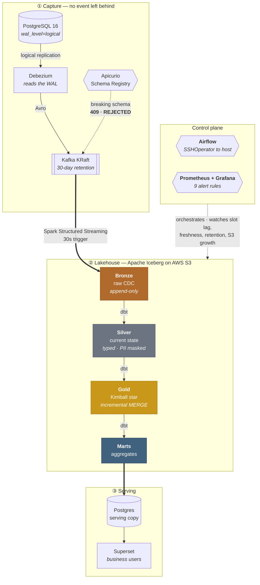
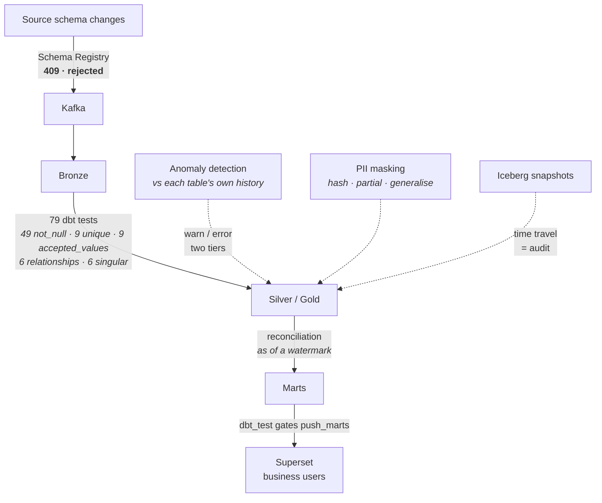

# Governed Transaction Lakehouse

[](https://github.com/Senryuu-0211/Governed-Transaction-Lakehouse/actions/workflows/ci.yml)


A near-real-time banking transaction pipeline and **governed lakehouse**, built
correctness-first and governance-first. It captures every transaction change via
**Change Data Capture (CDC)** with no lost events, lands it in an **ACID lakehouse**
with audit and time-travel, and enforces data quality, lineage, and PII controls.

> **Designed for bank-scale, demoed at small scale — and the boundary is stated explicitly.**
> The architecture is built to scale to billions of transactions; the demo runs at a modest
> rate on a single host. Where a choice is "designed to scale to X" vs "demo runs at Y", the
> code says so.

**What this repo is really about:** not that these tools were wired together, but *why each
one is there and what breaks without it*. Every threshold, retention window, and guard rail
below traces to a specific failure — several of which happened here, on this hardware, and are
written up in [`issues/`](issues/) rather than quietly fixed.

---

## Architecture

Compute runs on-premise; storage is **real AWS S3**.



**Cloud-ready by design — and proven, not asserted.** The pipeline started on MinIO and moved to
real AWS S3 by changing an endpoint and credentials: `dbt build` came back **82 PASS / 0 ERROR**
with **no model or job code changed**. Because all storage access goes through the **S3 API**,
moving further into the cloud (Glue + Athena) is an endpoint change, not a rewrite — one codebase
serves both on-premise and cloud, with no vendor lock-in.

> **The honest counterweight:** compute on-premise + storage in the cloud means every byte Spark
> reads from S3 is billed egress, and the round trip to `us-east-1` measures **249 ms** from here.
> Data gravity is not a slogan — it is 249 ms multiplied by the number of requests, which is why
> [cost control](#storage-cost-control-learned-the-hard-way) is a first-class concern below.

---

## Where correctness is enforced

Quality is a **gate**, not a report. Each arrow below is a place the pipeline refuses to continue.



Currently **12 dbt models** guarded by **79 tests**. Concretely, on the last full run:
**683,527 transactions**, **$2,844,556,184.33** reconciled between Bronze and Gold with a
difference of **exactly 0**.

The reconciliation is worth one more sentence, because the naive version of it was wrong in an
instructive way. Comparing a *live* Bronze against a *frozen* Gold reported a **$129 M** gap on
its first run — every cent of which was an artifact of Bronze continuing to ingest while Gold
stood still. The fix was to reconcile **as of a watermark** (Silver's `max(_kafka_offset)`),
filtering offsets *before* deduplication. A reconciliation that cries wolf is worse than none,
because the second time it fires nobody looks.

---

## Tech stack (and why, not just what)

| Layer | Tool | Rationale |
|---|---|---|
| Source OLTP | **PostgreSQL 16** (`wal_level=logical`) | Clean logical-replication slot for CDC |
| CDC | **Debezium** | Reads the WAL — captures INSERT/UPDATE/**DELETE** in commit order; timestamp-polling misses deletes |
| Log / streaming bus | **Kafka (KRaft)** | Industry standard (MSK); KRaft removes ZooKeeper |
| Stream + batch compute | **Apache Spark** | Scales past single-machine RAM to bank-size data |
| Transform modelling | **dbt** (dbt-spark) | Structure, tests, docs, lineage over Spark execution |
| Lake storage | **AWS S3** (was MinIO) | Storage is reached only through the S3 API, so the move off MinIO was an endpoint swap, not a rewrite |
| Table format | **Apache Iceberg** | ACID, time-travel (audit), schema evolution, engine-agnostic |
| Schema contract | **Apicurio + Avro** | An incompatible source schema is rejected **at the Kafka gate** (409) instead of silently nulling columns downstream |
| Catalog | **Iceberg REST** → Glue (Part 2) | Lightweight locally; Glue is the AWS-native target |
| Orchestration | **Airflow** (LocalExecutor) | Airflow *orchestrates*, the host *computes* — jobs run via `SSHOperator` in a real venv, not inside the scheduler |
| Observability | **Prometheus + Grafana** | Reuses the `node_exporter` already running 24/7 via its textfile collector — no extra daemon to die silently. **Loki was deliberately cut**: one host, `docker logs` is enough, and an unused log store is cost without insight |

**Correctness rules baked in:** money is `DECIMAL`, never float; `FAILED` transactions are not
real money; `REVERSED` transactions are never double-counted; Bronze total reconciles to Gold
each run.

---

## Storage cost control (learned the hard way)

Streaming into a lakehouse writes a new file every micro-batch. Left alone, that filled a 468 GB
disk with **397 GB** of small and orphaned files. On object storage the same failure mode is a
*bill*, not just a full disk — every file written is a paid PUT request. Four controls, all in
the repo rather than in someone's memory:

- **Slower trigger** — 30 s instead of 5 s, roughly 6× fewer files and PUTs for the same data.
- **Compaction** (`rewrite_data_files`) — small files merged to ~128 MB.
- **Orphan cleanup** (`remove_orphan_files`) — the control that was *missing*. `expire_snapshots`
  only deletes files that were once committed; a job killed mid-write leaves files no snapshot
  ever referenced, and those accumulate forever. Retention is 72 h, deliberately: a file still
  being written looks exactly like an orphan, so a shorter window would delete live data.
- **A least-privilege IAM user scoped to one bucket, plus a budget alert** — blast radius and
  spend are both bounded.

`python scripts/s3_admin.py usage` reports size, object count, average object size (a small
average *is* the small-files problem), and estimated monthly cost.

---

## Roadmap

| Phase | Goal |
|---|---|
| **1 — CDC pipeline** | CDC flows end-to-end → Bronze Iceberg captures INSERT/UPDATE/DELETE |
| 2 — Medallion transform | Gold star schema + dbt structural tests (quality as a gate), correct REVERSAL |
| 3 — Orchestration | Airflow-driven, idempotent, backfillable |
| 4 — Advanced governance | Time-travel audit, lineage, reconciliation, anomaly detection, PII masking |
| 5 — Observability | Lag/freshness dashboards + alerting, gated by a maintenance-window flag |
| 6 — CI/CD + IaC | CI gates every push; Terraform validated on LocalStack ($0) |
| Part 2 — Real AWS | S3 + Glue + Athena (endpoint swap) |

---

## Status

- ✅ **Phase 1 · Step 1a** — Postgres source + logical replication + data faker
- ✅ **Phase 1 · Step 1b** — Debezium + Kafka KRaft (CDC → topics)
- ✅ **Phase 1 · Step 1c** — Spark Structured Streaming → Bronze Iceberg on **AWS S3**
- ✅ **Phase 2** — Medallion transform on **dbt-on-Spark**: Silver current-state (typed, PII-masked,
  soft-delete), Gold Kimball star schema, 71 dbt tests as a gate, lineage docs; **Superset**
  dashboards over a Postgres serving copy of the marts
- ✅ **Phase 2.5** — **Schema Registry (Avro)**: Debezium emits Avro through Apicurio; incompatible
  source schema changes are **rejected at the Kafka gate** instead of silently nulling downstream
- ✅ **Phase 3** — Airflow orchestration: two DAGs (`gtl_transform` hourly, `gtl_maintenance`
  daily) driven from the existing containerized Airflow via **`SSHOperator` to host-side
  Spark/dbt** (Airflow orchestrates, the host computes); `dbt_test` **gates** `push_marts` so bad
  data never reaches Superset; `verify_3.sh` 6/6 and a full end-to-end run green (dbt 11 models,
  71 tests, marts refreshed)
- ✅ **Phase 4** — Advanced governance: append-only `audit_reconciliation` ledger reconciled
  **as of a watermark** (Silver's `max(_kafka_offset)`) rather than live-vs-frozen — the naive
  version reported a $129M gap that was entirely an artifact of Bronze moving while Gold stood
  still; fact table converted to **incremental MERGE** carrying `is_deleted`; **two-tier**
  anomaly severity (`warn_if` / `error_if`) benchmarked against each table's own history;
  PII masking + a `not_null` test that caught a silent regression which had nulled `birth_year`
  for every account for days. `verify_4.py` 13/13
- ✅ **Phase 5** — Observability: pipeline health metrics exported to a `.prom` file read by the
  **node_exporter already running 24/7** (textfile collector) → Prometheus → Grafana, with a
  `GTL · Pipeline Health` dashboard and **9 alert rules**, each one tied to an incident that
  actually happened rather than to a round number. A `gtl_pipeline_enabled` flag written by
  `pipeline.sh` acts as a maintenance window, so deliberately shutting the pipeline down to save
  S3 cost stays silent while an unplanned death still pages. `verify_5.sh` 16/16 —
  see **[docs/observability.md](docs/observability.md)**
- ✅ **Phase 6a** — CI: four jobs gate every push (ruff + 14 unit tests · `dbt parse` · gitleaks ·
  `docker compose config` + shellcheck). The governing rule is that **CI only runs what does not
  need real infrastructure** — recreating Postgres, Kafka, Spark and S3 inside a runner would be
  both slow and *fake*, and a quality gate built on a fake environment is worse than none because
  it goes green and you relax. So: **CI catches static faults, `verify_*.sh` catches real ones.**
  On its first run CI found three genuine defects, including a `.env.example` that still described
  MinIO — dropped weeks earlier — which meant *nobody could clone this repo and start it*

---

## Seeing it run

<!-- Ảnh chụp: xem docs/screenshots/README.md để biết cần chụp gì và chụp thế nào. -->

| | |
|---|---|
|  | **`GTL · Pipeline Health`** — replication-slot lag (the metric that protects the *source* database, not the pipeline), Bronze freshness, position within the Kafka retention window, and S3 growth |
|  | **Superset over the serving marts** — the point of the whole system: a non-technical user answering their own question, without reading any code |
|  | **`gtl_transform`** — `dbt_test` *gates* `push_marts`, so data that fails its tests never reaches the dashboard |

Verification is scripted rather than described, so the claims above are checkable:

```console
$ bash scripts/verify_5.sh
== VERIFY PHASE 5 — OBSERVABILITY ==

[1/5] Nguồn: exporter ghi được file .prom
  ✅ exporter chạy không lỗi
  ✅ gtl_exporter_up = 1 (mọi nguồn số liệu đều lấy được)
  ...
[5/5] Cổng maintenance window: tắt pipeline thì alert phải IM
  ✅ cờ hạ xuống 0 khi pipeline tắt
  ✅ biểu thức có cổng trả VỀ RỖNG khi cờ = 0

KẾT QUẢ: 16 PASS · 0 FAIL
✅ Phase 5 thông suốt từ nguồn tới cảnh báo
```

```console
$ bash scripts/pipeline.sh status
container   : 8/8 đang chạy
bronze_stream: 🟢 đang ghi (commit 12s trước)
lag Bronze  : 37 message

BUCKET gtl-lakehouse-…
  tổng: 4.64 GB · 19,555 object
  kích thước TB/object: 248.8 KB (quá nhỏ = small-files problem = nhiều PUT = tốn tiền)
```

Note what `pipeline.sh status` does *not* do: it never reports the stream as healthy just because
a process exists. A dead Spark query once sat in the process table for ten hours while `pgrep`
happily reported it running, so liveness is measured by **checkpoint age** — the only evidence
that the stream is actually committing.

### Step 1a highlights
- `wal_level=logical` with replication slots ready for Debezium
- Schema: `accounts` (PII-tagged), `transactions` (money `DECIMAL`, status lifecycle
  `PENDING → COMPLETED/FAILED → REVERSED`), `merchants`; `REPLICA IDENTITY FULL` for CDC before-images
- **Least-privilege CDC role** (`REPLICATION` + `SELECT` only) with a scoped publication
- `updated_at` maintained by a DB trigger; secrets kept in `.env` (never committed)
- Faker mixes INSERT + status UPDATE + REVERSAL and mutates balances on completion

### Step 1b highlights
- **Kafka KRaft** single broker (no ZooKeeper); **Kafka Connect + Debezium** Postgres connector
- Connector uses the least-privilege `debezium` role + pre-created `dbz_publication` (autocreate disabled)
- `pgoutput` plugin; one topic per table (`gtl.public.*`); versioned connector config, idempotent registration
- **`decimal.handling.mode=string`** — money stays exact through Kafka (never float)
- **CDC safety:** `max_slot_wal_keep_size=10GB` — a lagging replication slot gets invalidated
  instead of filling disk and crashing the source DB (slot-lag = the #1 metric to watch, Phase 5)
- Verified full Debezium envelope: `r` (snapshot), `c` (insert), `u` (update with before/after
  status), `d` (delete with before + null after + tombstone)

Run: `docker compose up -d --build` → `bash scripts/register-connector.sh` → `bash scripts/verify_1b.sh`.
Inspect topics/messages in Kafka UI at `localhost:8092`.

### Step 1c highlights

CDC now lands in an **ACID lakehouse**: three concurrent Spark Structured Streaming queries read
the Debezium topics into Iceberg tables on **AWS S3**, reached over the **S3 API**.

- **Bronze mirrors the source, one table per source table.** The fact table is partitioned by
  ingestion day; the two dimensions are not, because partitioning ~100 rows by day only scatters
  them into tiny files. Separate tables are also what makes Silver's `MERGE INTO` coherent later:
  `transactions` keys on `txn_id`, `accounts` on `account_id`.
- **Bronze stays raw.** The whole Debezium envelope is kept verbatim in one column, with only
  `op`, source timestamp, and Kafka coordinates lifted out for partitioning and traceability.
  A source schema change cannot break ingestion, and any disputed figure is traceable to the
  bytes the source actually emitted. Typing, PII masking, and deduplication belong to Silver.
- **Independent queries, independent checkpoints** — the busy fact stream cannot stall the
  dimensions, and any one table can be restarted or backfilled alone.
- **S3 access through Iceberg's `S3FileIO`** (`iceberg-aws-bundle`) rather than
  `hadoop-aws` + `aws-java-sdk-bundle`, which removes the Hadoop/AWS SDK version conflict that
  makes this step fail for most people. Client jars and the REST catalog image are pinned to the
  same Iceberg version, and a smoke test proves the write path before any stream starts.
- **Verified end to end:** ~16.9M Bronze rows with `op` values `c`, `u`, **and** `d`, money still
  exact as a string, and a steady lag of tens of messages behind the source.

Run: `PYTHONPATH=spark python spark/bronze_layer/bronze_stream.py` → `bash scripts/verify_1c.sh`.
Inspect storage usage and cost with `python scripts/s3_admin.py usage`.

---

## CDC operational safety

Two mechanisms that separate "operated CDC in production" from "followed a tutorial":

- **Replication-slot protection.** Debezium holds a replication slot, so Postgres cannot recycle
  un-consumed WAL — a stalled or dead consumer could fill the source disk and crash the core DB.
  `max_slot_wal_keep_size=10GB` invalidates a lagging slot (recoverable via re-snapshot) instead
  of filling disk: **sacrifice the pipeline before the source system.** Slot lag (`retained_wal`)
  is the **#1 metric to monitor** — ahead of consumer lag (Phase 5).
- **Only committed transactions reach Bronze.** Debezium reads via **logical decoding** (not raw
  WAL), so it emits only committed changes, in commit order; rolled-back transactions never appear.
  Bronze is clean by construction — no in-flight/dirty rows to filter out.
- **Kafka is a buffer with an expiry date, not an archive.** Bronze is the archive — but only if
  it consumes before retention deletes. This pipeline hit exactly that during development: the
  broker ran on its 7-day default while capture was live and no durable consumer existed yet, so
  the oldest change events were dropped, silently. `startingOffsets=earliest` does not save you —
  "earliest" means the oldest message *still present*, not the oldest ever written. The fix is
  `retention.ms` sized to **the longest consumer outage worth surviving** (30 days here, measured
  at ~3 GB/day) plus a `retention.bytes` ceiling, on the same principle as the replication-slot
  limit: bound the damage. Retention only buys time, though — the real control is **alerting when
  the consumed offset approaches the oldest available one** (Phase 5, alongside slot lag).

---

## Quick start (Step 1a)

```bash
cp .env.example .env          # set credentials
docker compose up -d --build  # Postgres + faker
docker compose ps             # postgres healthy, faker up

bash scripts/verify.sh        # automated 11-point checkpoint (exit != 0 on failure)
```

Source DB: `postgresql://<user>@localhost:5433/banking`

---

## Repo layout

```
docker-compose.yml            # Step 1a stack (Postgres + faker)
postgres/init/                # 01_schema.sql · 02_cdc_role.sh (runs on empty volume)
faker/                        # synthetic transaction generator (never real PII)
scripts/verify.sh             # automated checkpoint
issues/                       # tracked design issues / follow-ups
```

## Design notes
See [`docs/design-notes.md`](docs/design-notes.md) for the **ingestion pattern**, **delivery
semantics** (why at-least-once), and the **idempotency / dedup strategy** that makes each
transaction count exactly once without chasing exactly-once delivery.

## Design philosophy & planned extensions

A governed data platform must serve **decision-makers, not just the data team** — governance only
has value when a non-technical user can answer *"what is this table, where's it from, can I trust
it?"* through a UI. Planned once the core (Phase 1–4) is solid:

- **Lineage visualization** for business users — DataHub / OpenMetadata (rich discovery, heavier),
  or lightweight OpenLineage + Marquez (native to Airflow/Spark/dbt).
- **AI year-end report** — an LLM writes the *narrative* around numbers that are **computed and
  fixed by code** (the LLM never touches the numbers; charts are code-rendered). Hallucination-safe
  by construction — essential for financial figures.

## Notes
- Postgres init scripts run only on an **empty volume** — changing schema needs `docker compose down -v`.
- `down -v` deletes data; confirm you're on the throwaway/test host first.
- Ports are tracked in `issues/PORTS.md`.
- Synthetic data only (Faker) — no real personal data anywhere.
